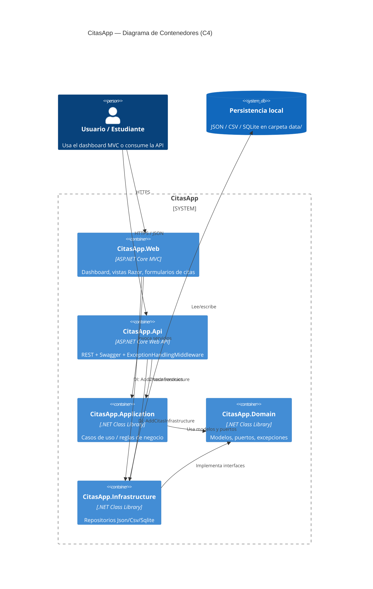
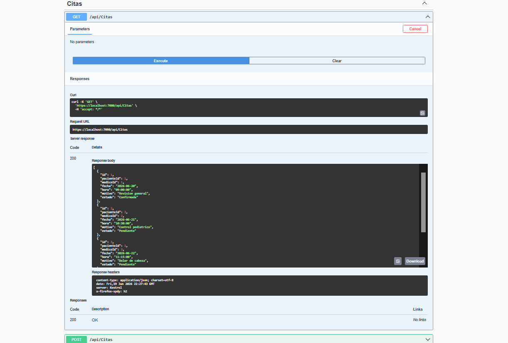

# CitasApp - Sistema de Gestión Médica

**Autor:** Roberto Balmes  
**Curso:** Arquitectura de Software  
**Stack principal:** ASP.NET Core (.NET 10) · Arquitectura Hexagonal (Puertos y Adaptadores)

---

## Descripción del proyecto

**CitasApp** es un sistema de gestión médica académica que permite consultar pacientes y médicos, agendar/confirmar citas y exponer un módulo auxiliar de calculadora. La solución está organizada en capas desacopladas (Domain → Application → Infrastructure) con **dos adaptadores de entrada**:

| Proyecto | Rol |
|----------|-----|
| `CitasApp.Web` | Aplicación **ASP.NET Core MVC** con dashboard/home cyberpunk y vistas Razor |
| `CitasApp.Api` | **REST API** documentada con Swagger + middleware de excepciones |
| `CitasApp.Domain` | Modelos, puertos (interfaces) y excepciones de negocio |
| `CitasApp.Application` | Casos de uso (`PacienteService`, `MedicoService`, `CitaService`, `CalculadoraService`) |
| `CitasApp.Infrastructure` | Adaptadores de persistencia **Json / Csv / Sqlite** (intercambiables) |
| `CitasApp.Tests` | Suite de pruebas unitarias con **xUnit** |

La pantalla de inicio (`Views/Home/Index.cshtml`) actúa como **dashboard de navegación** hacia Pacientes, Médicos, Agenda y Calculadora.

La persistencia por defecto lee/escribe archivos JSON en la carpeta `data/` de cada host (`pacientes.json`, `medicos.json`, `citas.json`). El proveedor se cambia sin recompilar Domain ni Application.

```
Api / Web  →  Application  →  Domain
Api / Web  →  Infrastructure → Domain
```

---

## Arquitectura (visión C4 — Contenedor)



Documentación de decisiones: ver `ADR-01-Roberto.md` (incorporación de la API REST) y `DECLARACION-IA.md`.

---

## Stack tecnológico

| Área | Tecnología |
|------|------------|
| Runtime / framework | .NET 10 (`net10.0`), ASP.NET Core |
| UI | Razor Views, CSS propio (`wwwroot/css/site.css`) |
| API | Controllers + Swagger / OpenAPI (Swashbuckle) |
| Persistencia | `System.Text.Json`, CSV plano, `Microsoft.Data.Sqlite` |
| DI | Contenedor nativo de ASP.NET Core (`IServiceCollection`) |
| Pruebas | xUnit, Microsoft.NET.Test.Sdk |
| CI/CD | GitHub Actions (`.github/workflows/dotnet.yml`; referencia adicional `ci.yml`) |
| Arquitectura | Hexagonal / Ports & Adapters + MVC |

---

## Patrones de diseño (según el código real)

| Patrón | Dónde aparece | Para qué |
|--------|---------------|----------|
| **Inyección de Dependencias (DI)** | `CitasApp.Web/Program.cs`, `CitasApp.Api/Program.cs` | Registra servicios y repositorios en el contenedor IoC; los controladores reciben dependencias por constructor. |
| **Repository + Ports & Adapters** | `IPacienteRepository`, `IMedicoRepository`, `ICitaRepository` en Domain; implementaciones en `Infrastructure/Repositories/{Json,Csv,Sqlite}` | Desacopla la lógica de negocio del motor de persistencia. |
| **Factory Method / Abstract Factory (composición)** | `CitasApp.Infrastructure/DependencyInjection.AddCitasInfrastructure` | Según `Persistencia:Proveedor` (`Json` \| `Csv` \| `Sqlite`) instancia el adaptador correcto y lo registra contra el puerto. |
| **Middleware (pipeline / “decorator” de request)** | `CitasApp.Api/Middleware/ExceptionHandlingMiddleware` | Envuelve el pipeline HTTP y traduce excepciones de Domain/Infrastructure a códigos HTTP JSON. |

**No se encontró** una implementación clásica de **Observer** (`IObservable` / eventos de dominio) ni un **Decorator** GoF explícito sobre repositorios o servicios. El middleware es el acercamiento más cercano a “decorar” el flujo de request.

---

## CI/CD y pruebas

### GitHub Actions

El workflow activo está en [`.github/workflows/dotnet.yml`](.github/workflows/dotnet.yml):

1. Se dispara en `push` y `pull_request` hacia `master`.
2. Configura .NET `10.0.x`.
3. Ejecuta `dotnet restore` → `dotnet build` → `dotnet test` sobre `CitasApp.Tests`.

Existe además un borrador/referencia `ci.yml` en la raíz (orientado a .NET 9); el workflow canónico del curso es el de `.github/workflows/`.

### Suite local

```bash
dotnet test CitasApp.Tests/CitasApp.Tests.csproj
```

Las pruebas actuales (`CitaTests`, `PacienteTests`, `MedicoTests`) siguen Arrange–Act–Assert con xUnit. **Nota:** hoy son comprobaciones mínimas/placeholder; no ejercitan aún `CitaService` ni los repositorios JSON. Ampliarlas es una mejora recomendada.

> El proyecto `CitasApp.Tests` existe en disco pero **no está incluido en `CitasApp.sln`**. Conviene agregarlo a la solución para que Visual Studio y `dotnet test` a nivel solución lo descubran de forma uniforme.

---

## Instrucciones de ejecución local

### Requisitos

- [.NET 10 SDK](https://dotnet.microsoft.com/download)
- Visual Studio 2022 / Rider / VS Code (opcional)

### Opción A — Visual Studio / Rider

1. Abrir `CitasApp.sln`.
2. Click derecho en `CitasApp.Web` **o** `CitasApp.Api` → **Set as Startup Project**.
3. F5 / Run.
4. Web: dashboard en `/`. API: Swagger en `/swagger`.

### Opción B — Línea de comandos

```bash
# API
cd CitasApp.Api
dotnet restore
dotnet build
dotnet run
# Swagger: https://localhost:<puerto>/swagger
```

```bash
# MVC / Dashboard
cd CitasApp.Web
dotnet restore
dotnet build
dotnet run
# UI: https://localhost:<puerto>/
```

### Cambiar persistencia

En `appsettings.json` de Api o Web:

```json
"Persistencia": {
  "Proveedor": "Json"
}
```

Valores válidos: `Json`, `Csv`, `Sqlite`. La selección ocurre en `DependencyInjection.AddCitasInfrastructure`.

---

## Estructura del repositorio

```
CitasApp/
├── CitasApp.sln
├── .github/workflows/dotnet.yml
├── ADR-01-Roberto.md
├── DECLARACION-IA.md
├── CitasApp.Domain/
├── CitasApp.Application/
├── CitasApp.Infrastructure/
├── CitasApp.Api/
├── CitasApp.Web/
└── CitasApp.Tests/
```

---

## Capturas de pantalla

> Reemplaza las rutas de imagen cuando generes las capturas reales (carpeta sugerida: `docs/`).

### Dashboard / Home (MVC)


*Placeholder — captura de `Home/Index` con las cards Pacientes, Médicos, Agenda y Calculadora.*

### Agenda de citas


*Placeholder — captura de `Cita/Index` o formulario `Cita/Agregar`.*

### Swagger — API REST



*Placeholder — captura de `/swagger` con endpoints de Pacientes, Médicos, Citas y Calculadora.*

### Persistencia JSON (opcional)


*Placeholder — captura de la carpeta `data/` con `pacientes.json`, `medicos.json`, `citas.json`.*

---

## Licencia / uso académico

Proyecto desarrollado por **Roberto Balmes** para el curso de Arquitectura de Software. Uso educativo.
